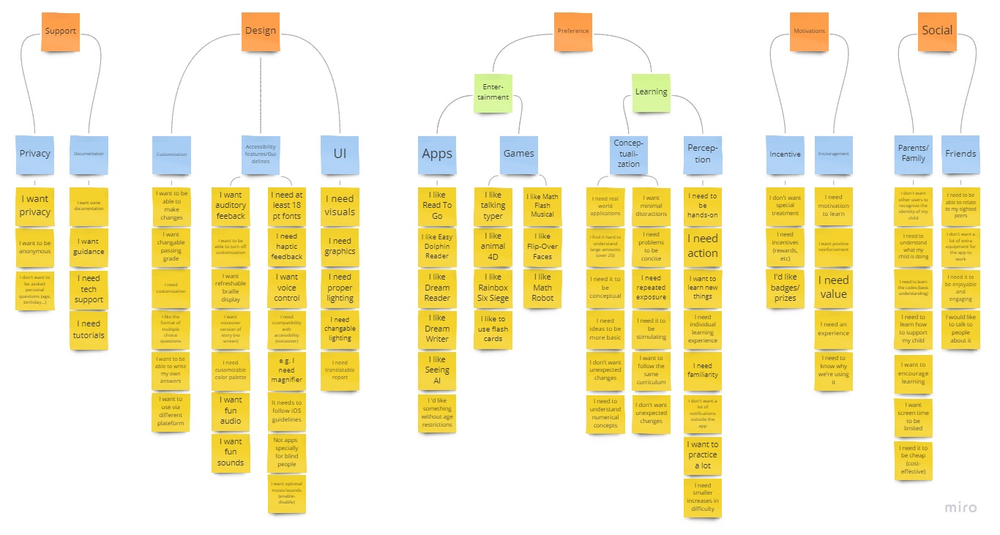

# Milestone 2: Contextual Inquiry

[Milestone 1](https://irezystible.github.io/620project/Milestone1)
  [Milestone 3](https://irezystible.github.io/620project/Milestone3)
  [Milestone 4](https://irezystible.github.io/620project/Milestone4)
  [Milestone 5](https://irezystible.github.io/620project/Milestone5)
  [User Testing Follow-Up](https://irezystible.github.io/620project/UserTesting)

As a team, we began this process by first discussing various contacts that may have relevant knowledge or experiences to the project. The contact pool ranged from teachers, friends, family and co-workers.

Utilizing our team's network we approached former connections from the American Printing House for the Blind and were referred to a representative from the NYC Department of Education. After some research, we discovered the New York State School for the Blind was relativley close to the institution. We decided to call and see if some of the teachers would be willing to be interviewed.

In the end, we managed to interview representatives of our stakeholders. We thank the following people for their time and for imparting their knowledge and experience with the group:

* Heather Kennedy-Mackenzie, Technology Project Manager from the American Printing House for the Blind
* Carol Pangrazio, High School Classroom Teacher of the Visually Impaired at the NYS School for the Blind
* Julie Zielonka, Teacher of the Visually Impaired at the NYS School for the Blind
* Gian Pedulla, Educational Vision Services Supervisor at the NYC Department of Education

[Click here to view the team's interview questions](https://irezystible.github.io/620project/interviewquestions)

After all the interviews were conducted, the team met up to review the notes and parse through new information. We created first person statements and wrote them down on different post it notes. We first grouped them at the most basic levels and worked our way to the top labels.

*Picture of post it notes are scattered on the table containing personal statements derived from interview answers*

*Picture of some team members working on posting the notes on the wall and categorizing them*

Some of the most important concepts that we have learned through the process are as follows:

* Age range is more inclusive. It goes beyond the projected 4-8yr old target audience. Some teachers have expressed that high school students can sometimes also have trouble learning some basic math concepts. It is also important to note that the concepts included in the app may be expanded to reach higher level subject matters like basic algebra
* For younger kids who are blind and visually impaired (B/VI), numbers after 20 are harder to grasp conceptually because they can not attribute value to substanital objects as easily as their peers who have experienced these concepts visually. Comparing the sizes of a car to a bus, for example, is hard to determine. It is also easier to illustrate 50 oranges compared to having them touch 50 oranges on a table. Therefore, we need to encourage learning these basic math concepts without focusing on visuals.
* (B/VI) children also have trouble with using technology itself. They do not have as much motivation to learn a specific kind of technology if they do not understand the value of everything a phone, for example, can do for them. We need to be able to motivate the children to learn and use the app as well as understand how it is valuable to them.
* Parents are not as involved as originally anticipated because of the learning barrier. It is not as easy to teach/follow a child's progress when parents do not understand some foreign tools themselves (Braille, Nemeth Math)
* Each learning experience varies per individual based on the available technology. They are less likely to be studying in groups, but would love to be able to participate in peer activities without a lot of extra support tools.

 

***We must always remember that we are designing a game that is accessible, not an accessible game***
