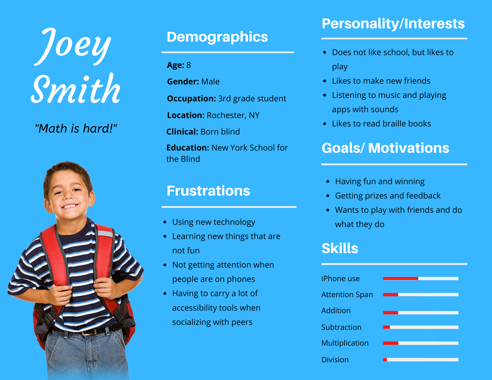
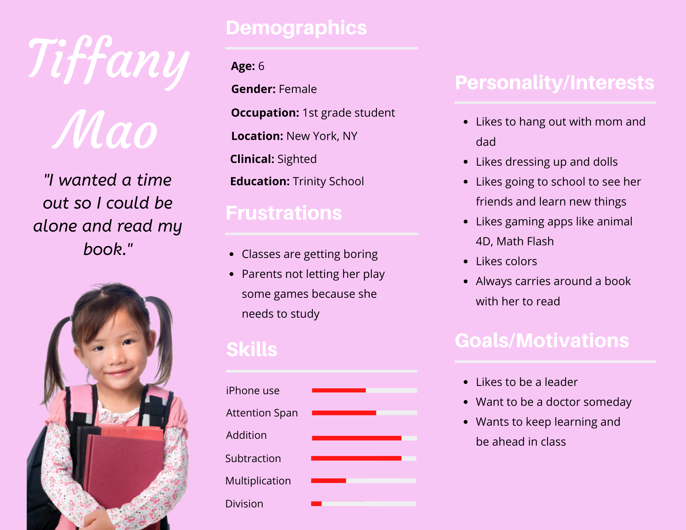
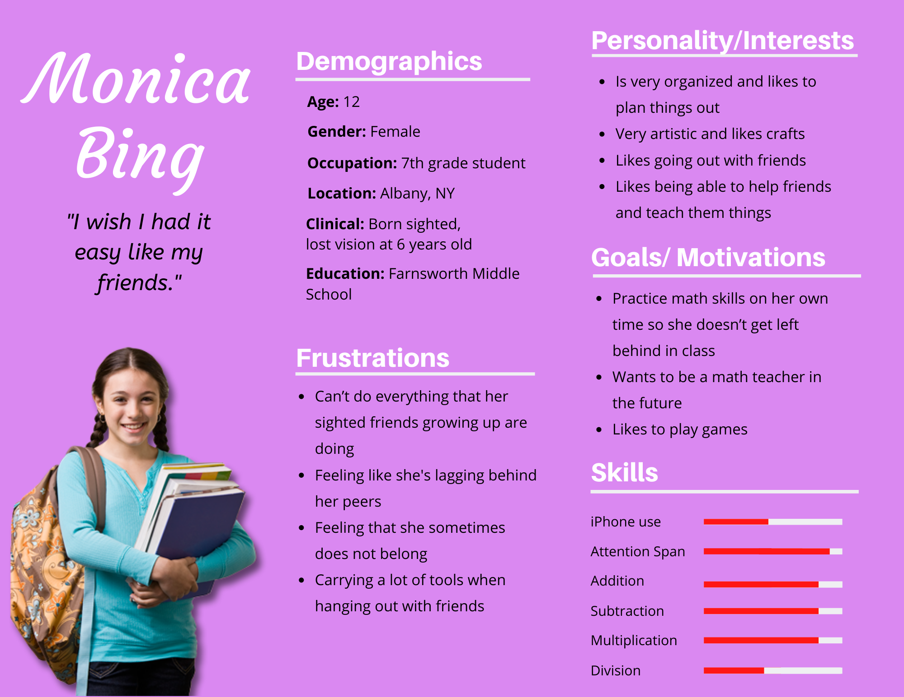
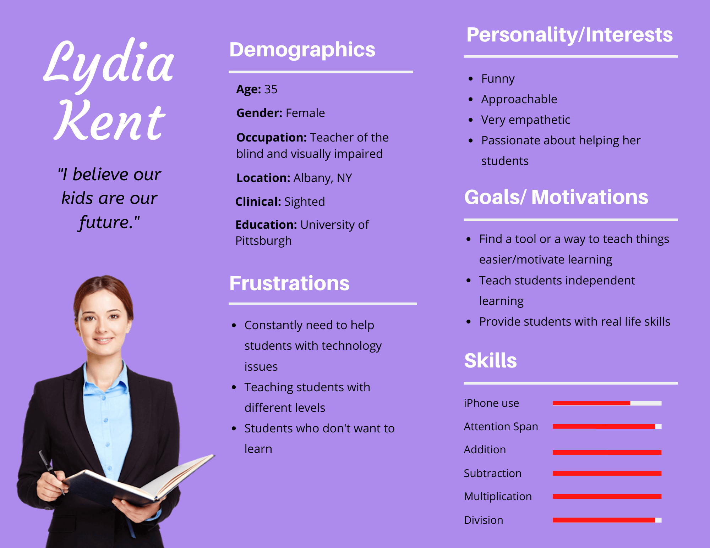
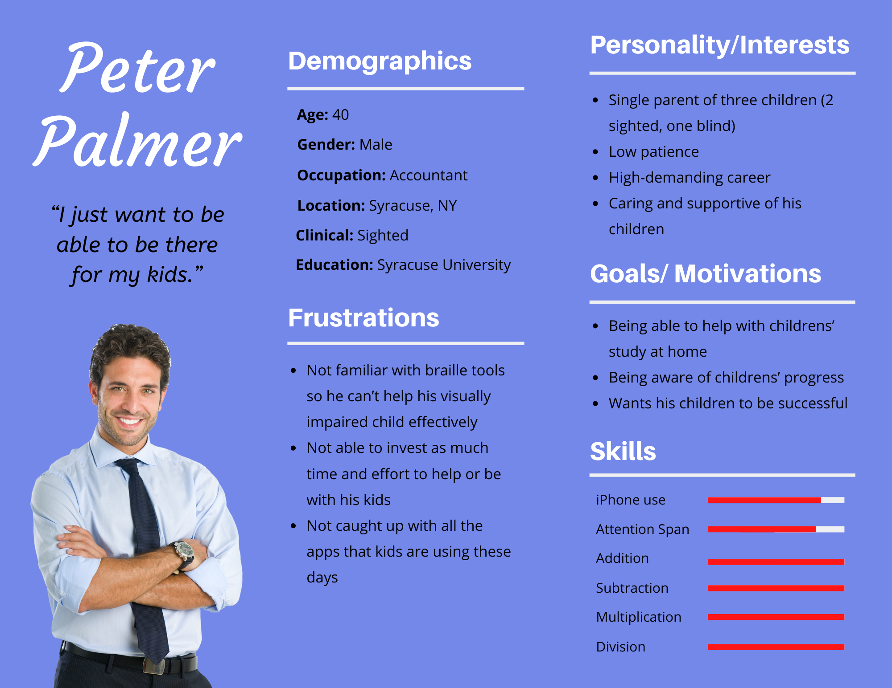
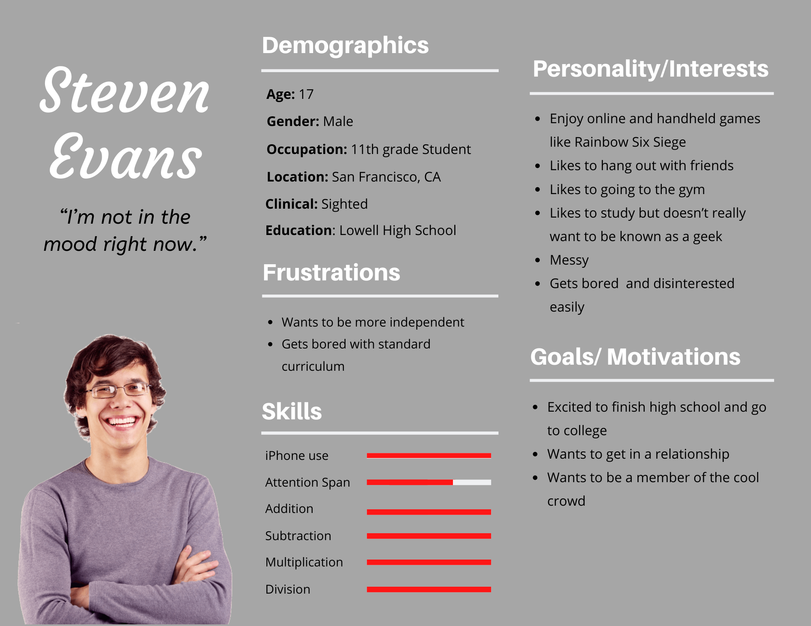

# Milestone 3: Persona

[Milestone 1](https://irezystible.github.io/620project/Milestone1)
  [Milestone 2](https://irezystible.github.io/620project/Milestone2)

For the third milestone, we were tasked to create different personas that would correspond to the app's potential user base.

## Primary

We have decided to have two primary users since we are striving to create a fully accessible game. This means that the final prototype should not only be useful for sighted kids but also to those who are blind and visually impaired.

### Joey Smith
Joey is an 8 year old 3rd grade student of the New York School for the Blind in Rochester who was born blind. He is not very interested with school and find learning new things frustrating, but he does love to play and make friends. He especially likes listening to music, playing with apps with a lot of sounds, and getting prizes for winning. He has a short attention span, not very good with iPhones, and needs a lot of practice in math.

### Tiffany Mao
Tiffany is a 6 year old 1st grade student of Trinity School in New York City. She loves to learn and read and is very advanced in her classes. She likes to play games but does not get a lot of opportunity to do so because her parents want her to study. She knows how to use an iPhone fairly well and is already at the multiplication level.

## Secondary

These secondary users are those who may have in interest in using the app, either for themselves or to interact with the primary user of the app.

### Monica Bing
Monica is a 12 year old 7th grade student at Farnsworth Middle school in Albany who lost her vision when she was 6 years old. She is very organized, artistic, and social but fears that she may lag behind her sighted friends. She is interested in practicing her math skills on her spare time because she wants to be a teacher someday. She is an average iPhone user with a high attention span. She is currently struggling a bit with division.

### Lydia Kent
Lydia is a teacher of the blind and visually impaired at Albany. She is passionate about her students and would love to find tools that can help them succeed. She struggles finding one that is easy enough for the kids to learn because most of her kids almost always has technology issues.

### Peter Palmer
Peter is a signle father to three children, one of whom is blind. He has a very demanding career as an accountant and finds himself too busy to help and spend time with his kids. He would like to be able to help his kids succeed and be there for them.

## Anti-Persona

An anti-persona is the type of user who will have potentially little to no interest in the app.

### Steven Evans
Steven is a 17 year old 11th grade student of Lowell High School in San Francisco. He likes to play a lot of games, hang out with his friends, and go to the gym. He has excellent academic skills but would rather not be known for it. He wants to be more independent and is excited and really to go to college.

