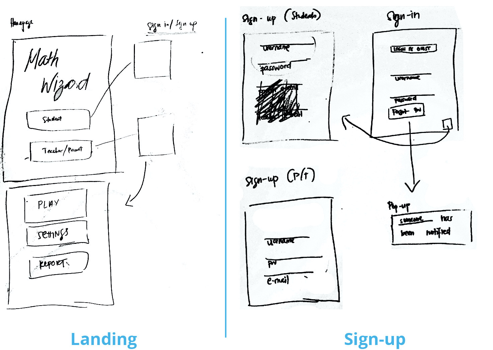
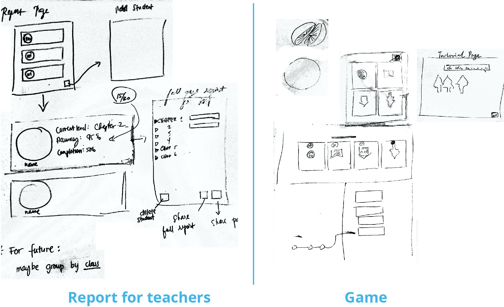

# Milestone 4: Lo-Fi Prototype

[Milestone 1](https://irezystible.github.io/620project/Milestone1)
  [Milestone 2](https://irezystible.github.io/620project/Milestone2)
  [Milestone 3](https://irezystible.github.io/620project/Milestone3)

The team first met to discuss an overview of the app's design on paper. In order to transition easier to a Hi-Fi prototype, we decided to translate the paper designs on to Figma. This also proved a better option for online collaboration especially when the team was not able to meet in person.

 
 

## Try it out!

[Play with the Math Wizard Lo-Fi Prototype!](https://www.figma.com/proto/J2jEOUF4xTHsIh4KchPEfO/Math-wizard-e?node-id=53%3A386&scaling=scale-down)

The team is aware of certain limitations in this iteration of the project. These will be fixed in the next version:
* Some buttons in the Settings pages have limited functionality at this time. It may not show consistent visuals based on what the user have chosen (does not show deactivated buttons all at the same time).
* There are transitional animations present in some of the frames. These random animations will be changed and polished in the next iteration.
* Horizontal and vertical scrolling options in the Report pages will be improved.

## Behind The Scenes

<iframe style="border: none;" width="800" height="450" src="https://www.figma.com/embed?embed_host=share&url=https%3A%2F%2Fwww.figma.com%2Ffile%2FJ2jEOUF4xTHsIh4KchPEfO%2FMath-wizard-e%3Fnode-id%3D0%253A1" allowfullscreen></iframe>

