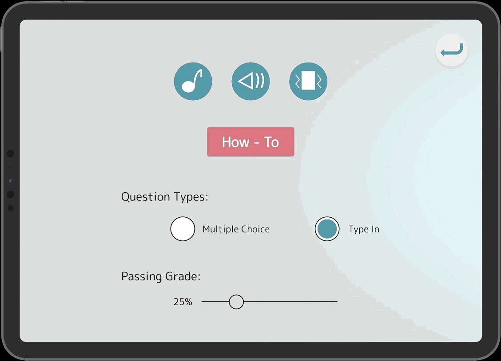
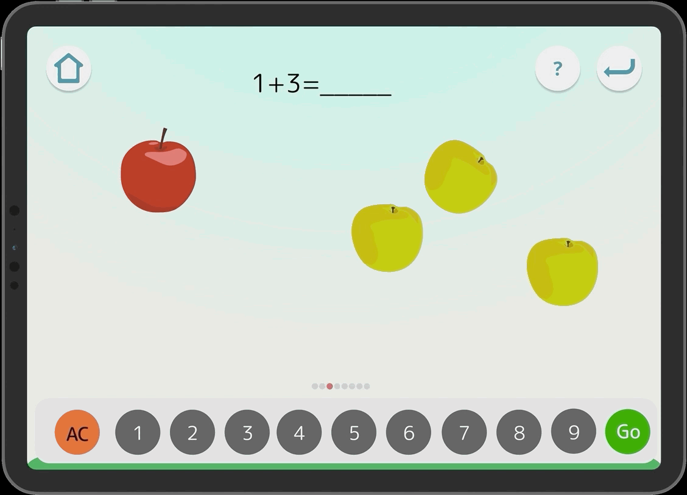
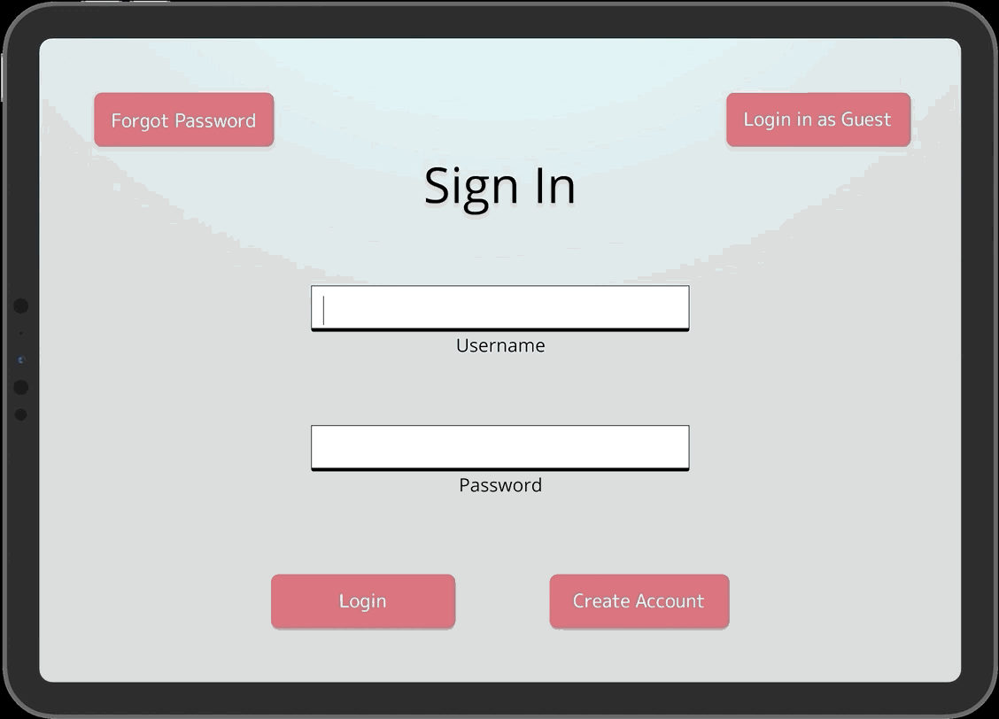
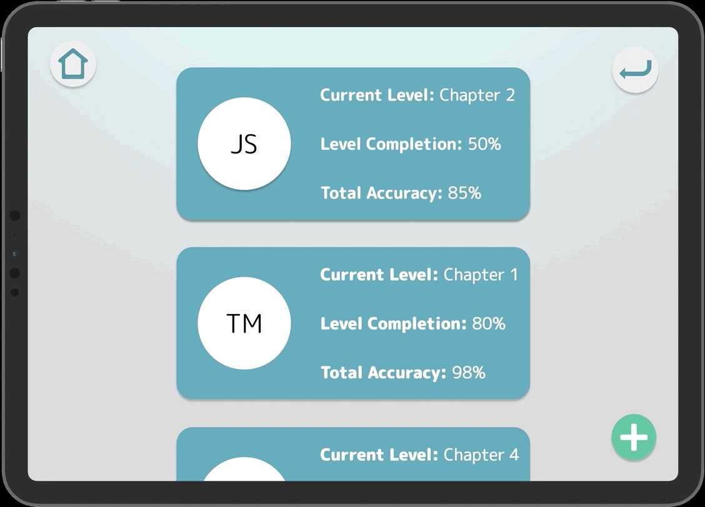

# Milestone 5: Hi-Fi Prototype

[Milestone 1](https://irezystible.github.io/620project/Milestone1)
  [Milestone 2](https://irezystible.github.io/620project/Milestone2)
  [Milestone 3](https://irezystible.github.io/620project/Milestone3)
  [Milestone 4](https://irezystible.github.io/620project/Milestone4)

The team sought input from friends and peers about the Lo-Fi design. Some suggestions were related to the visual appeal -- color, icon placement, font size. Others, such as the addition of an onboarding process, is for user ease. We've also added a background story to encourage users, especially younger ones, to be more excited about the game.

During development, the team referred to [The 12 Principles of UX in Motion](https://medium.com/ux-in-motion/creating-usability-with-motion-the-ux-in-motion-manifesto-a87a4584ddc) to help provide animations that would help present better content to the user.

### Dimensionality

A concept called <b><i>origami dimensionality</i></b> was used in the motion of the how-to page. As the how-to slides in to the page from the bottom, it creates a layering feeling as if a new object has been put in front of the current page.

### Overlay

We have taken advantage of [Figma's](https://www.figma.com/) amazing overlay functions to seamlessly add notifications and prompts such as in the example above.

### Obscuration

Along with overlay, we have also made sure to highlight more important pieces of the screen by putting a darker background behind the keyboard. This makes it so the user can easily divert their attention to the new piece of information with less distraction.

### Parenting

We applied the idea of <i><b>direct parenting</b></i> to display progress within levels using a small progress bar in the bottom of the screen. The red dot moves as you move on to the next question. By having these in the bottom, the user is more aware as to how many questions are left and how many have already passed.

### Easing

There is a slow transition as the user moves from the main report page which shows all of the students to the detailed report page for the selected student.

## Play!

Below is a video that shows a walkthrough of the game and its current functionalities. Enjoy!

<iframe width="650" height="400" src="https://www.youtube.com/embed/T59qLF_bOV0" frameborder="0" allow="accelerometer; autoplay; encrypted-media; gyroscope; picture-in-picture" allowfullscreen></iframe>
