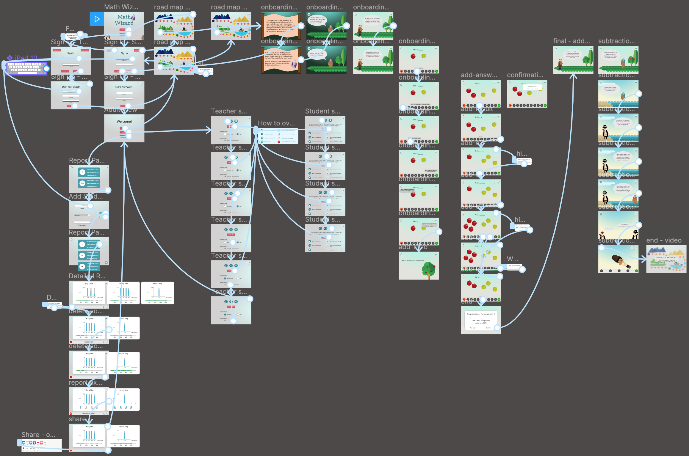
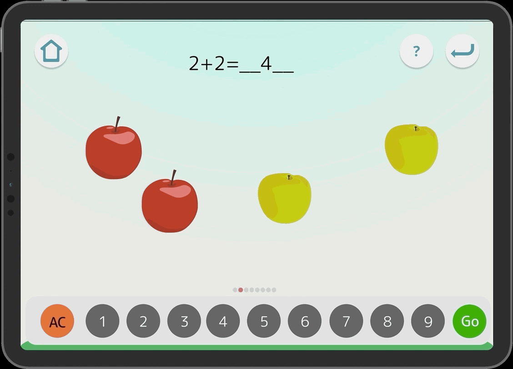

# Milestone 5: Hi-Fi Prototype

[Milestone 1](https://irezystible.github.io/620project/Milestone1)
  [Milestone 2](https://irezystible.github.io/620project/Milestone2)
  [Milestone 3](https://irezystible.github.io/620project/Milestone3)
  [Milestone 4](https://irezystible.github.io/620project/Milestone4)
  [User Testing Follow-Up](https://irezystible.github.io/620project/UserTesting)

The team sought input from friends and peers about the Lo-Fi design. Some suggestions were related to the visual appeal -- color, icon placement, font size. Others, such as the addition of an onboarding process, is for user ease. We've also added a background story to encourage users, especially younger ones, to be more excited about the game.

We explored different color palettes that are typically used in apps for kids. We wanted to make the game vibrant but not too much where it becomes distracting. The team also made sure to be aware of certain colorblindess issues so we checked for contrast throughout the entire process. We made sure fonts are readable and that sizes are also large enough to satisfy large print qualifications. Because this is only a prototype, we cannot include accessibility requirements such as voiceover. However, we developed the game so that each button is readable by itself and no important information is blended into the background. Most of the graphics present in game were developed by team member. Some, however, were downloaded for free from Google's vector stock images.

Because the game is open to users of all ages, we decided to ask for as little information from the Student view as possible. This information asked is only enough to be able to make the game portable (be played through different devices).

### Prototyping

The team included several connections for a proper playthrough of the whole game. Extra connections were removed to limit confusion. This shows just enough to exhibit different button functionalities as well as be able to traverse through all of the frames easily. 

## UX in Motion

During development, the team referred to [The 12 Principles of UX in Motion](https://medium.com/ux-in-motion/creating-usability-with-motion-the-ux-in-motion-manifesto-a87a4584ddc) to help provide animations that would help present better content to the user.

### Dimensionality

A concept called <b><i>origami dimensionality</i></b> was used in the motion of the how-to page. As the how-to slides in to the page from the bottom, it creates a layering feeling as if a new object has been put in front of the current page.

### Overlay

We have taken advantage of [Figma's](https://www.figma.com/) amazing overlay functions to seamlessly add notifications and prompts such as in the example above.

### Obscuration

Along with overlay, we have also made sure to highlight more important pieces of the screen by putting a darker background behind the keyboard. This makes it so the user can easily divert their attention to the new piece of information with less distraction.

### Parenting

We applied the idea of <i><b>direct parenting</b></i> to display progress within levels using a small progress bar in the bottom of the screen. The red dot moves as you move on to the next question. By having these in the bottom, the user is more aware as to how many questions are left and how many have already passed.

### Easing

There is a slow transition as the user moves from the main report page which shows all of the students to the detailed report page for the selected student.

## Play!

Below is a video that shows a walkthrough of the game and its current functionalities. Enjoy!

<iframe width="650" height="400" src="https://www.youtube.com/embed/T59qLF_bOV0" frameborder="0" allow="accelerometer; autoplay; encrypted-media; gyroscope; picture-in-picture" allowfullscreen></iframe>
