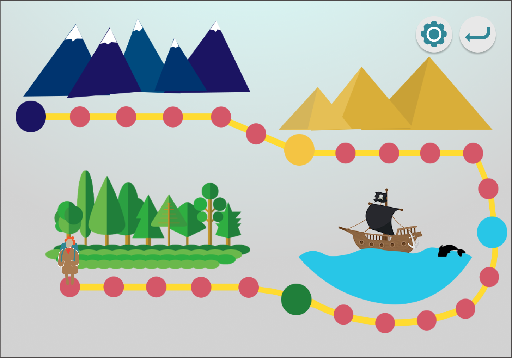
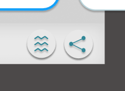

# User Testing Follow-Up

[Milestone 1](https://irezystible.github.io/620project/Milestone1)
  [Milestone 2](https://irezystible.github.io/620project/Milestone2)
  [Milestone 3](https://irezystible.github.io/620project/Milestone3)
  [Milestone 4](https://irezystible.github.io/620project/Milestone4)
  [Milestone 5](https://irezystible.github.io/620project/Milestone5)

To wrap up the project, some user testing and refinements were done to the hi-fi prototype. Due to COVID-19, the team was able to test only a select number of people. Most of the users are not reflective of the primary personas, unfortunately.

### Buttons:

#### The back buttons:
Some back buttons were not made clear about where they lead to, or find unnecessary in some game screens, which can be especially problematic for no vision and low vision users.
For further development, the back buttons on the game screen would be replaced with a pause button. So that users can then choose whether they want to restart/ quit/pause.

#### The En button: 
It was unclear to some participants and was replaced by a go button. This was used to confirm answers and proceed to the next question.

### Student Settings:

The group realized that there were no connections made for the Student Settings. This differs from the Teacher Settings because students should not be able to edit passing grades and the type of questions involved. We went on to add the settings button in the roadmap. In the future, we would like to have this in all game pages for more accessibility -- students will be able to change settings for sound and vibrations any time they want.

### Report pages:

The different buttons for the Share and Share Full Report were confusing to a user. He was not sure what the information inside the Share Full Report would be compared to what was already on the detailed report page in game, especially because a lot of the important summary is viewable.

### Review by a sighted 9-year old boy who is doing advanced math
The notes below are from his personal feedback and were also reviewed by him before posting:

* It's interesting that the people in the graphics do not have eyes - it makes it more special!
* The colors and graphics were nice and inviting
* The number of questions is fair (he was curious on how to pass a level and how many questions he needed to finish per level)
* This would have helped when I was learning basic math
* The story is good. I liked it. If it didn't have a story, I would not be interested
* I would have liked to see the boss and what I would need to do to win. Do I fight the boss? Or just keep answering questions?
* The question type does not matter to me

### Overall experience:

* Participants were able to follow through; received positive feedback on the narratives
* Some participants claimed that the feedback after each question was hindering their speed
* Participants mentioned that the game was clean and fluid, with easy transitions between pages. They also said that it was easy to follow and very straightforward
* Participants gave praise to the good use of color and overall graphics
* Easy sign up process and good option to login as guest if the user doesn’t want to create any account

